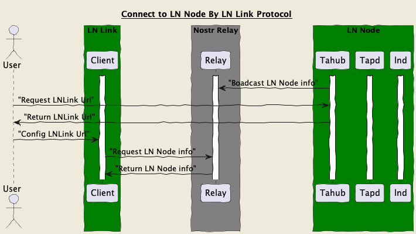

LN Node Link --> LNLink
======
`draft` `optional`

## Rationale
LN Node Link describes a way for clients to access a remote LN Node  through a standardized protocol. Custodians may implement this, or the user may run a bridge that bridges their wallet/node and the Nostr Wallet Connect protocol.

LN Node Link is built on the Nostr Protocol and is also compatible with the NWC protocol ([Nostr Wallet Connect protocol](https://github.com/nostr-protocol/nips/blob/master/47.md)).

## How it works
### Connect To LN Node With LNLink

### Work With Lnd(Lightning Support)

### Work With Tapd(Taproot Assets Support)

## API

### NWC APIs 
LNLink will support all [Nostr Wallet Connect protocol](https://github.com/nostr-protocol/nips/blob/master/47.md) APIs. Currently, it supports the following APIs:

#### Events
✅ `NIP-47 info event`: 13194
✅ `NIP-47 request`: 23194
✅ `NIP-47 response`: 23195

#### APIs (Nostr Wallet Connect)

✅ `get_info`

✅ `get_balance`

✅ `pay_invoice`
- ⚠️ amount not supported (for amountless invoices)
- ⚠️ PAYMENT_FAILED error code not supported

✅ `make_invoice`

✅ `list_transactions`

✅ `lookup_invoice`

### LN Link APIs (More)
#### [LN Link protocol](./APIS.md)
