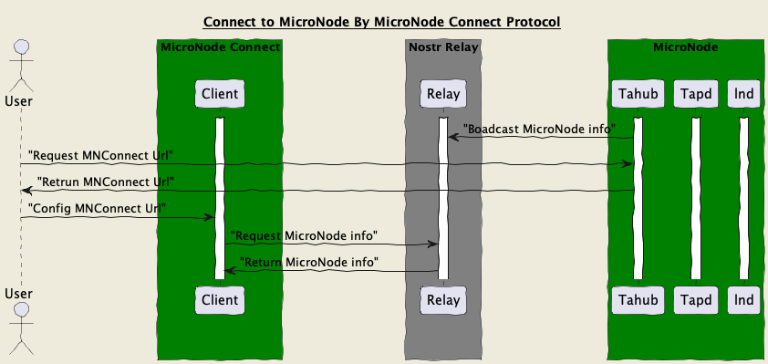
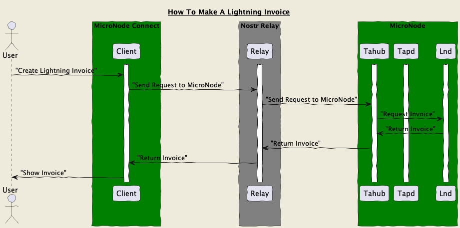
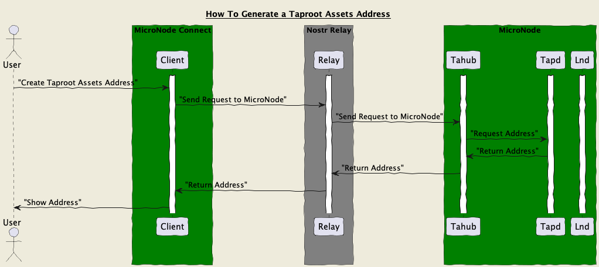

MicroNode Connect --> MNConnect
======
`draft` `optional`

## Rationale
MicroNode Connect describes a way for clients to access a remote MicroNode  through a standardized protocol. Custodians may implement this, or the user may run a bridge that bridges their wallet/node and the Nostr Wallet Connect protocol.

MicroNode Connect is built on the Nostr Protocol and is also compatible with the NWC protocol ([Nostr Wallet Connect protocol](https://github.com/nostr-protocol/nips/blob/master/47.md)).

## How it works
### Connect To MicroNode With MNConnect


### Work With Lnd(Lightning Support)


### Work With Tapd(Taproot Assets Support)


## API

### NWC APIs 
MNConnect will support all [Nostr Wallet Connect protocol](https://github.com/nostr-protocol/nips/blob/master/47.md) APIs. Currently, it supports the following APIs:

#### Events
✅ `NIP-47 info event`: 13194
✅ `NIP-47 request`: 23194
✅  `NIP-47 response`: 23195

#### APIs

✅ `get_info`

✅ `get_balance`

✅ `pay_invoice`
- ⚠️ amount not supported (for amountless invoices)
- ⚠️ PAYMENT_FAILED error code not supported

✅ `make_invoice`


### General Info APIs

#### initOwner
Request: 
```jsonc
{
    "method": "mn_initOwner",
    "params": {
        "name":"",
        "owner":"npub1234"
    }
}
```

Response:
```jsonc
{
    "result_type": "mn_initOwner",
    "result": {
        "nodeInfo": [
            
        ],
    },
}
```

#### mn_getinfo
Request:
```jsonc
{
    "method": "mn_getinfo",
    "params": {
    }
}
```

Response:
```jsonc
{
    "result_type": "mn_getinfo",
    "result": {
        "nodeInfo": [
            
        ],
    },
}
```

### For Lnd APIs
Coming Soon

### For TaprootAssets APIs
Coming Soon

### For P2PMarket APIs
Coming Soon