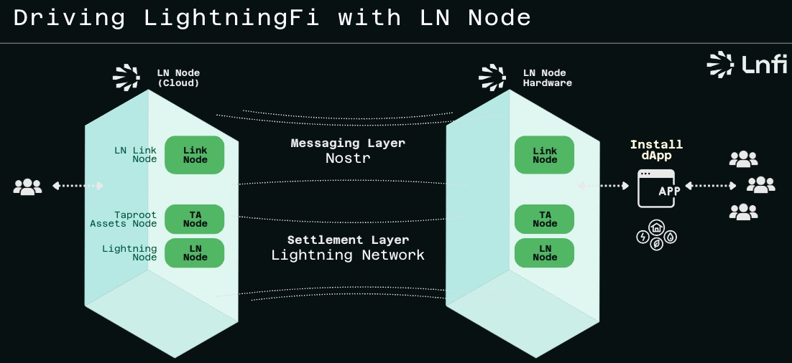

# LN Node
## What is LN Node
LN Node is a service, empowered by Nostr, designed to simplify the setup and management of a Lightning node, requiring zero technical proficiency from users. This empowers individuals to self-custody their assets, including but not limited to Bitcoins and Taproot Assets, and digital identity within the Lightning Network, fostering greater adoption.

## How it works
- Users exclusively hold the Lightning Network Daemon’s (LND’s) seed, ensuring that only they have control over their funds. This principle emphasizes that your keys are your assets, putting the security and responsibility of your funds entirely in your hands.
- Users interact with their LN Node via the Nostr protocol. All users’ undertaken actions are signed and authenticated using the Nostr Private Key, ensuring genuine user authorization.
- Users can also create LN Link URLs based on the LN Node, enabling quick and convenient use of the LN Node with any third-party service that supports LN Link.

- LN Nodes can also communicate with one other via the Nostr protocol, increasing the utility of LN Nodes. By extending Dapps based on LN Nodes, interoperability and composability are greatly extended.

## When it Scales
- As LN Nodes develop, they will form an LN Node network based on the Lightning Network. Users can engage in various LightningFi activities, such as Channel Mining, on this network.

## LN Link Protocol
- [Detail](./LNLink/README.md)

More Info : 
1. [Early Access](https://docs.lnfi.network/ln-node/user-guide)
2. [Terms](https://docs.lnfi.network/terms)